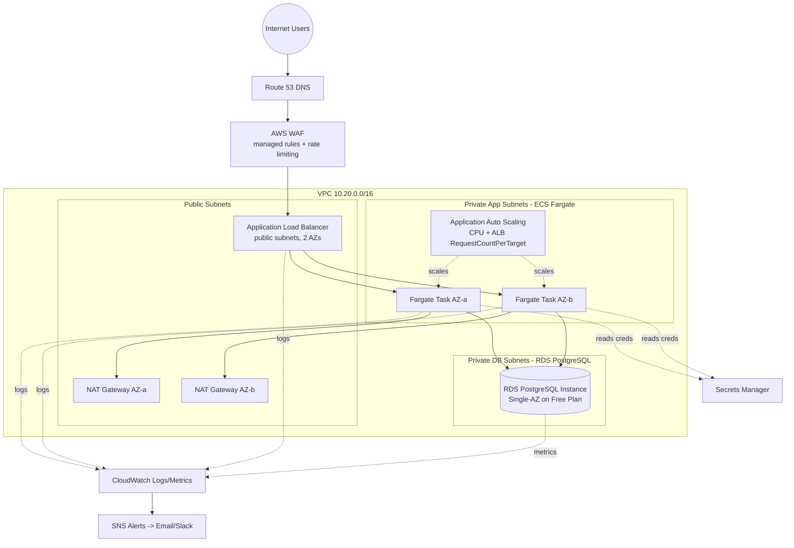

# Architecture Diagram (quick view)

> The authoritative editable diagram is [`diagram.drawio`](./diagram.drawio) — open it at https://app.diagrams.net.
> This Mermaid version renders directly on GitHub for a fast preview.

## Tier summary

| Tier | Components | Subnet placement | Internet reachability |
|---|---|---|---|
| Presentation | Static assets served by app container, browser | N/A (client-side) | Direct via ALB |
| Application | ECS Fargate service (Node.js/Express), Application Auto Scaling | Private-app subnets, 2 AZs | Only via ALB; egress via NAT for ECR/Secrets Manager/CloudWatch |
| Data | RDS PostgreSQL, Single-AZ by default (`multi_az` togglable) | Private-db subnets | None — no route to internet at all |

> **Note:** the data tier was originally designed as Aurora PostgreSQL
> Serverless v2 with a writer + reader across 2 AZs. It was changed to a
> standard RDS PostgreSQL instance because AWS Free Plan accounts can only
> create Aurora clusters via an "express configuration" path that cannot be
> placed inside a customer VPC — incompatible with this project's private-
> network requirement. See `docs/ARCHITECTURE.md` section 4a for the full
> explanation and how to restore Multi-AZ/elastic scaling off the Free Plan.
